# Task Tracker

Project Description

Task Tracker is a simple web application that allows users to manage their daily tasks. Users can create tasks, view tasks, mark tasks as completed or pending, delete tasks, and filter tasks based on status and priority.

## Features

- Add a task with title, description, due date, and priority.
- All New task fields are required.
- View tasks sorted by nearest due date first.
- Mark tasks Done or Pending using a one-click toggle switch.
- Delete tasks with a browser confirmation prompt.
- Filter tasks by status: All, Pending, Done.
- Filter tasks by priority: All, Low, Medium, High.
- Show a live counter for pending and done tasks.
- Search box that filters tasks by title.
- Show a short `Task added.` success message after creating a task.
- Responsive Angular UI with a form panel, filters, task cards, priority chips, and status badges.

## Tech Stack

- PostgreSQL
- Node.js
- Express
- Angular
- TypeScript

## Project Structure

```text
TaskTracker/
├── backend/
│   ├── db.js
│   ├── schema.sql
│   ├── server.js
│   ├── package.json
│   └── .env

├── frontend/
│   ├── src/
│   │   └── app/
│   │       ├── components/
│   │       │   ├── task-form/
│   │       │   └── task-list/
│   │       ├── models/
│   │       │   └── task.ts
│   │       └── services/
│   │           └── task.ts
│   └── package.json
├── docs/
│   └── screenshots/
├── .gitignore
└── README.md
```

## Database Setup

Create a PostgreSQL database:

```sql
CREATE DATABASE task_tracker;
```

Run the schema and seed script:

```bash
psql -U postgres -d task_tracker -f backend/schema.sql
```

The script creates the `tasks` table and inserts three sample tasks.

Current schema:

```sql
CREATE TABLE IF NOT EXISTS tasks (
  id SERIAL PRIMARY KEY,
  title VARCHAR(200) NOT NULL,
  description TEXT NOT NULL,
  due_date DATE NOT NULL,
  priority VARCHAR(10) NOT NULL CHECK (priority IN ('Low','Medium','High')),
  is_done BOOLEAN NOT NULL DEFAULT FALSE,
  created_at TIMESTAMP NOT NULL DEFAULT NOW()
);
```

## Backend Setup

Install dependencies:

```bash
cd backend
npm install
```

Create a local environment file:

```bash
copy .env.example .env
```

Update `.env` with your PostgreSQL credentials:

```text
DB_USER=postgres
DB_PASSWORD=your_password
DB_HOST=localhost
DB_PORT=5432
DB_NAME=task_tracker
PORT=3000
```

Start the API:

```bash
npm start
```

The backend runs at:

```text
http://localhost:3000
```

## REST API

| Method | Endpoint | Description |
| ------ | -------- | ----------- |
| GET | `/api/tasks` | List tasks sorted by due date |
| GET | `/api/tasks?status=Pending&priority=High` | List filtered tasks |
| GET | `/api/tasks/:id` | Get one task |
| POST | `/api/tasks` | Create a task |
| PUT | `/api/tasks/:id` | Fully update a task, including Done/Pending |
| DELETE | `/api/tasks/:id` | Delete a task |

Create task example:

```bash
curl -X POST http://localhost:3000/api/tasks ^
  -H "Content-Type: application/json" ^
  -d "{\"title\":\"Submit assignment\",\"description\":\"Final review and upload\",\"due_date\":\"2026-06-18\",\"priority\":\"High\"}"
```

Update task example:

```bash
curl -X PUT http://localhost:3000/api/tasks/1 ^
  -H "Content-Type: application/json" ^
  -d "{\"title\":\"Complete Assignment\",\"description\":\"Finish Task Tracker\",\"due_date\":\"2026-06-18\",\"priority\":\"High\",\"is_done\":true}"
```

## Frontend Setup

Install dependencies:

```bash
cd frontend
npm install
```

Start Angular:

```bash
npm start
```

Open the app:

```text
http://localhost:4200
```

If Angular is started with an explicit host, use:

```bash
npm start -- --host 127.0.0.1 --port 4200
```

Then open:

```text
http://127.0.0.1:4200
```

## Screenshots

Application UI:

| Dashboard | Task List |
| --------- | --------- |
| 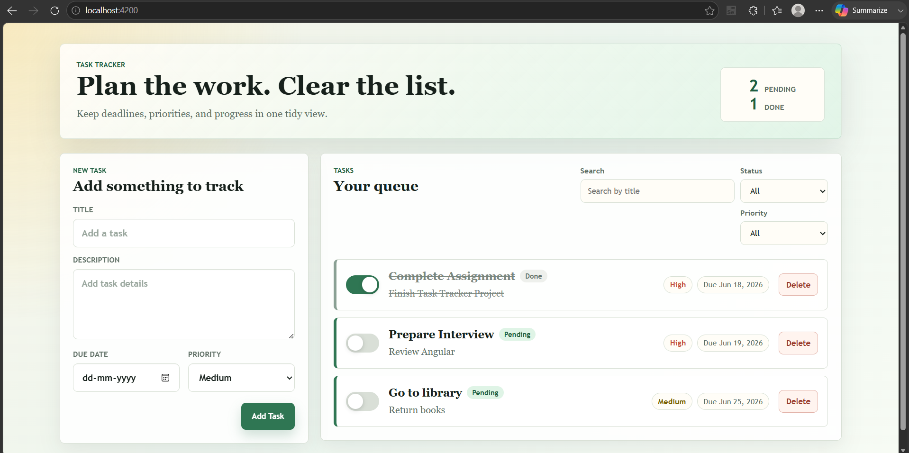 | 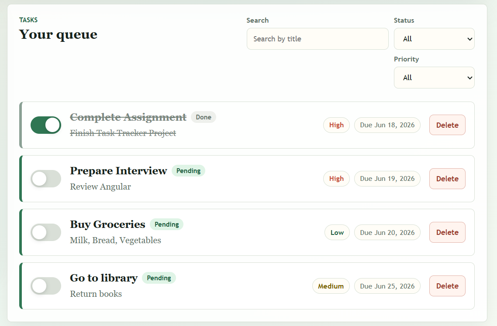 |

| Add New Task | Search Task |
| ------------ | ----------- |
| 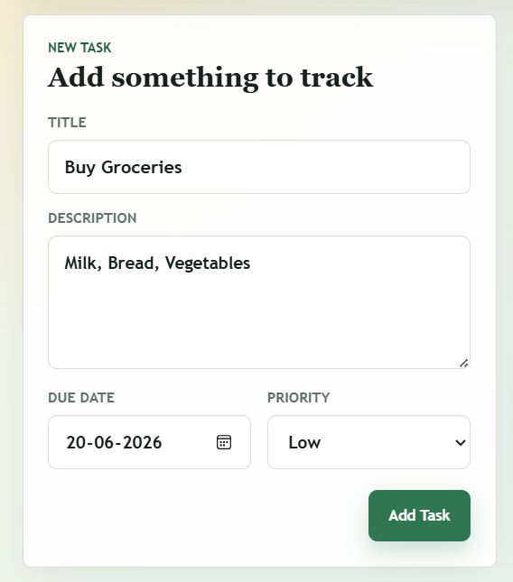 | 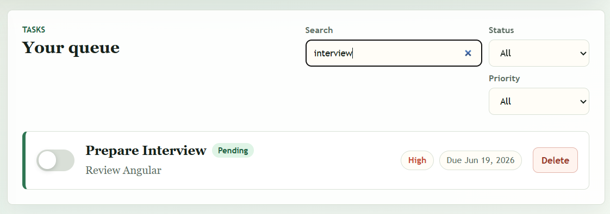 |

| Filter by Status | Filter by Priority |
| ---------------- | ------------------ |
| 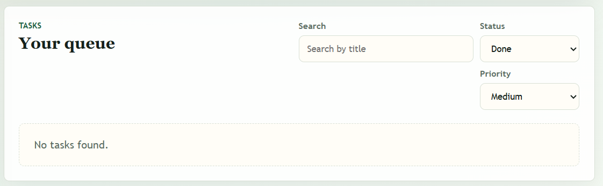 | 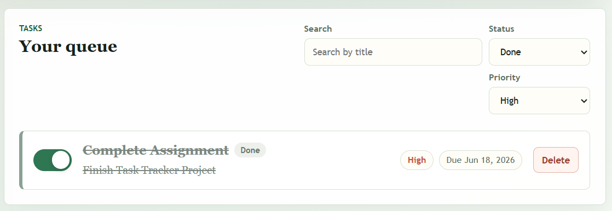 |

| Delete Task |
| ----------- |
| 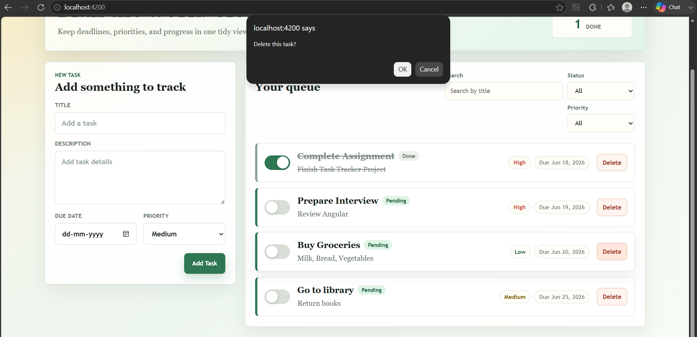 |

Database:

| Tasks Table |
| ----------- |
| 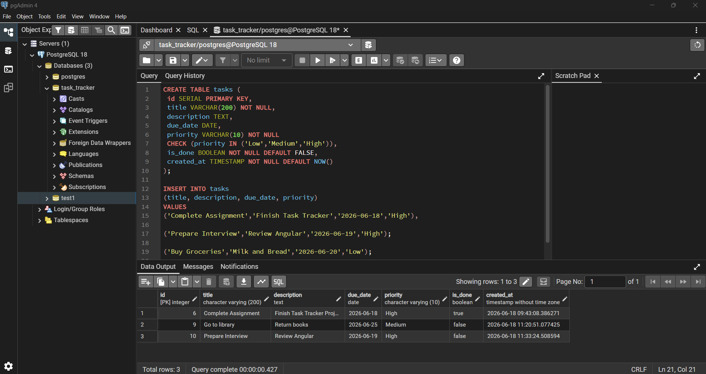 |

API testing with Postman:

| All Tasks | Single Task | Filtered Tasks |
| --------- | ----------- | -------------- |
|  | 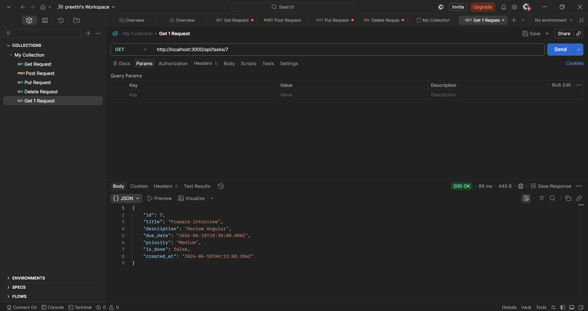 | 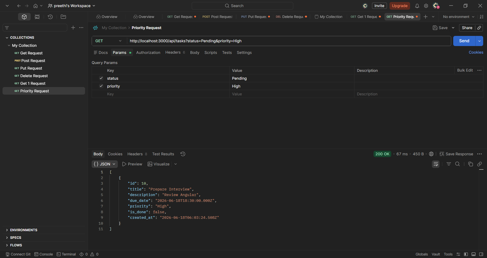 |

| Create Task | Update Task | Delete Task |
| ----------- | ----------- | ----------- |
| 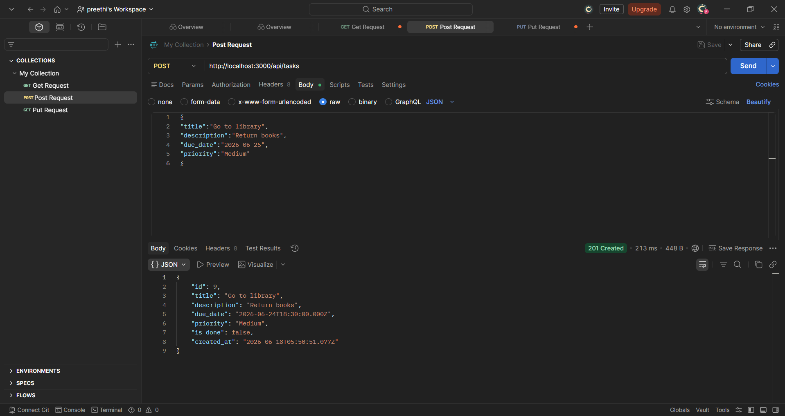 | 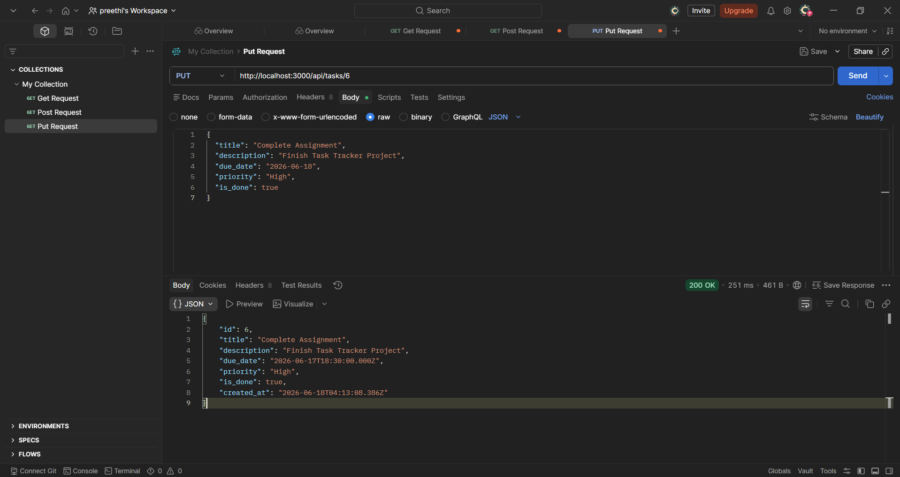 | 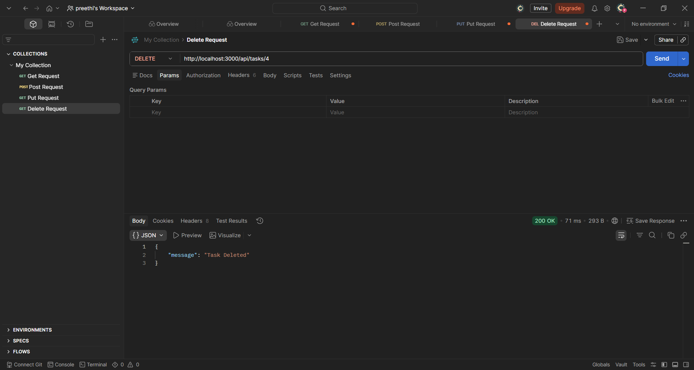 |

## Git History

The repository has at least five meaningful commits:

```text
f596b42 Initialize backend and Angular frontend structure
bbcb789 Add database schema and seed data
d0d6cf1 Build REST API task endpoints
f635e08 Implement Angular task tracker UI
93e27f6 Polish styling and documentation
```

Additional UI and validation changes were made after these commits.

## Verification

Backend syntax check:

```bash
node --check backend/server.js
```

Frontend production build:

```bash
cd frontend
npm run build
```

## Assumptions

- This is a single-user app, so authentication is not included.
- All task fields are required in the current implementation, based on the latest project change.
- `PUT /api/tasks/:id` is a full update endpoint and is also used by the UI to toggle Done/Pending.
- The frontend expects the backend API to run on `http://localhost:3000`.
- Tasks are sorted by due date, nearest first.

## What Was Completed

- PostgreSQL database schema with required task fields, priority validation, status flag, timestamps, and seed data.
- Express REST API with create, read, update, delete, status filtering, priority filtering, search tasks by title, input validation, and 404 handling.
- Angular frontend with task creation form, required-field validation, task list, status and priority filters, title search, live pending/done counters, delete confirmation, success message, and Done/Pending toggle.
- Responsive UI styling for the dashboard, form panel, filters, task cards, priority chips, status badges, and mobile layouts.
- Angular unit test setup updates for the app, task list, and task service.
- Screenshots added for the UI, database table, and Postman API testing.
- README updated with setup steps, API examples, screenshots, assumptions, verification commands, and completed-work summary.

## What Could Be Improved Next

- Add automated backend API tests.
- Add deeper Angular behavior tests for form validation, filtering, searching, deleting, and toggling.
- Optionally deploy the backend and frontend to free hosting.
